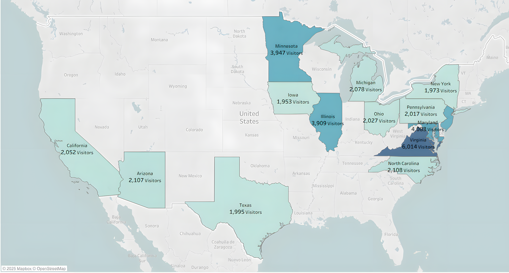

# 2025 Visitor Analysis for Theme Park Operations & Marketing

## Table of Contents

* [Introduction](#introduction)
* [Dataset Overview](#dataset-overview)
  * [Key Features](#key-features)
* [Data Exploration](#data-exploration)
  * [General Visitor Information](#general-visitor-information)
  * [Promotional Insights](#promotional-insights)
  * [Demographic Analysis](#demographic-analysis)
  * [Geographic Distribution](#geographic-distribution)
  * [Engagement Metrics](#engagement-metrics)
  * [Additional Exploration](#additional-exploration)
* [Data Cleaning & Preparation](#data-cleaning--preparation)
* [Analytical Framework](#analytical-framework)
* [Insights & Recommendations](#insights--recommendations)
  * [Insight 1](#insight-1)
  * [Insight 2](#insight-2)
  * [Insight 3](#insight-3)

## Introduction:
This analysis was conducted for the Head of Park Operations to identify key drivers of visitor attendance and duration during the 2025 season. The recommendations will be used by the marketing team to optimize Q4 campaign spending and by the operations team to adjust staffing for the upcoming holiday season.

The SQL analysis examines attendance trends, average group sizes, and international versus domestic travel patterns to provide clear, actionable insights for these strategic goals.

## Dataset Overview
The dataset provides a comprehensive set of visitor attributes, behavioral patterns, and operational metrics, capturing essential aspects of theme park attendance, engagement, and promotion activity.
The dataset enables exploration of visitor demographics, visit duration, group composition, ticket preferences, temporal trends, and the effectiveness of promotional campaigns.

### Key Features
*   **VisitorID:** Unique identifier assigned to each visitor record
*   **VisitDate:** Date on which the visit occurred
*   **TicketType:** Category of ticket purchased such as Family, Single, SeasonPass, VIP, or Child
*   **GroupSize:** Number of individuals included in the visiting group
*   **AgeGroup:** Age category of the visitor including Child, Teen, Adult, or Senior
*   **Residence:** City or area of origin of the visitor
*   **EntryTime:** Time of arrival at the park entrance
*   **ExitTime:** Time of departure from the park
*   **VisitDuration (Hours):** Total number of hours spent in the park, calculated from entry and exit times
*   **PromotionCode:** Promotional or discount code applied during the visit such as LOYALTY20, OPEN2018, or HOLIDAY50

## Data Exploration
### General Visitor Information:
*   How many total and unique visitors are recorded in the dataset?
*   What is the time range of visits based on the earliest and latest VisitDate?
*   What is the overall distribution of TicketType categories across all records?
*   Which TicketType has the highest number of purchases?
*   What is the average GroupSize per TicketType, and which ticket attracts larger groups?

### Promotional Insights:
*   How many visitors used a PromotionCode compared to those who did not?
*   Which TicketTypes are most commonly associated with active promotions?
*   Which promotions appear most frequently across all visit records?

### Demographic Analysis:
*   What is the distribution of visitors across different AgeGroup categories?
*   Which AgeGroup represents the largest share of total attendance?
*   What is the average VisitDuration for each AgeGroup, and how does it compare to TicketType averages?

### Geographic Distribution:
*   What are the most common Residence locations among visitors?
*   Which US states contribute the highest number of domestic visitors?
*   What percentage of total visitors come from international countries, and which countries contribute the most?

### Engagement Metrics:
*   What is the average VisitDuration for each TicketType?
*   Do Family or SeasonPass visitors tend to stay longer than Single or VIP visitors?
*   How does VisitDuration vary between domestic and international visitors?

### Additional Exploration:
*   Are there noticeable differences in visit behavior between age segments?
*   Does GroupSize influence the likelihood of using a promotion?
*   Which regions demonstrate higher participation in promotional campaigns?
*   What insights can be drawn about visitor engagement, demographics, and marketing effectiveness from the overall dataset?

## Data Cleaning & Preparation
The data cleaning process focused on ensuring consistency, accuracy, and readiness of the Visitors dataset for analysis. Each step aimed to standardize formats, handle missing values, and enrich the data with new contextual attributes.

Initial checks were performed to understand the table structure and identify potential irregularities in data types or formatting. A backup table was created to preserve the original dataset before any transformations were applied.

Data types were standardized to align with analytical requirements. VisitorID and categorical fields were converted to text formats of appropriate length. Numerical and temporal fields such as GroupSize, VisitDuration, EntryTime, and ExitTime were assigned suitable data types to allow proper calculations and aggregations.

Whitespace and empty string inconsistencies were addressed by trimming text values across key columns such as Residence and PromotionCode. Blank promotion codes were replaced with null values to maintain logical clarity in later analyses.

Geographic enrichment was introduced through the addition of two new fields. The Country column was created and populated based on each Residence value, distinguishing between domestic and international visitors. The US_State column was added to specify the state for all United States locations, enabling more detailed regional analysis.

Logical validation checks were conducted to ensure data integrity. Records with EntryTime later than ExitTime were identified for further review, and the presence of all expected state values was confirmed.

The final cleaned dataset provides a complete and consistent foundation for exploring visitor demographics, geographic distribution, and behavioral insights with confidence.

## Analytical Framework
The analytical framework defines the core questions guiding the exploration of visitor behavior, attendance trends, and promotional effectiveness. Each question targets a specific aspect of park operations and visitor engagement, ensuring a structured approach to data interpretation and insight generation.

**Q1. What are the monthly and yearly trends in total visitor counts to identify peak seasons and overall growth in attendance?**

This analysis explores attendance distribution across time, identifying high and low seasons and detecting long term growth patterns. It provides a foundation for strategic scheduling, resource planning, and marketing alignment with seasonal trends.

**Q2. What are the top countries and US states from which visitors originate?**

This question examines the geographic makeup of the visitor base, distinguishing between domestic and international origins. The results highlight key regions contributing to attendance and support data driven decisions in regional advertising and partnership strategies.

**Q3. How effective are different promotion codes in attracting visitors, measured by the number of uses per code?**

This analysis evaluates the performance of promotional campaigns by comparing the frequency of code usage. Understanding which promotions drive higher visitor numbers helps optimize future marketing efforts and pricing strategies.

**Q4. What is the average group size across all visits, and how does it vary by age group or ticket type?**

This question focuses on the relationship between demographic segments and visit behavior. It identifies which groups or ticket types are associated with larger parties and helps inform capacity management and targeted experience design.

**Q5. What are the average entry and exit times, and how do they help identify peak crowd hours?**

This analysis investigates visitor flow throughout the day by tracking hourly entry and exit patterns. The findings support operational decisions such as staff scheduling, queue management, and ride optimization.

**Q6. What is the average visit duration by month to assess visitor engagement and satisfaction levels?**

This question measures how long visitors stay in the park on average, segmented by month. It reveals patterns of engagement that can indicate satisfaction, event impact, or weather related attendance effects.

**Q7. How do visit patterns, such as duration and group size, differ between US and international visitors to tailor marketing strategies?**

This analysis compares domestic and international visitor behavior in terms of stay duration and group dynamics. The insights inform tailored communication and package offerings suited to each visitor category.

Together, these analytical questions form a cohesive framework that connects operational performance with visitor experience, enabling data driven strategies for growth, engagement, and efficiency.

**Q8. How does the average visit duration of U.S. citizens compare to that of international visitors across different seasons (Winter, Spring, Summer, Fall)?**

This analysis examines seasonal patterns in visit duration to determine whether international visitors tend to spend more time in the park than domestic guests within the same seasonal conditions.

By isolating seasonal effects, the comparison highlights behavioral differences driven by travel purpose and trip intensity rather than timing alone, offering valuable context for capacity planning, pricing, and experience optimization.

## Insights & Recommendations
### Insight 1

Analysis of 2025 seasonality confirms August was the peak attendance month with 730 visitors. This peak concluded a period of significant growth, with attendance increasing by 24.6% from May to August. The buildup included a 14.3% rise in June and a final 5.6% increase leading into August. This trend represents a shift from 2024, when the attendance peak occurred earlier in June with 720 visitors and was driven by a sharper initial increase. The sustained growth through August 2025 confirms that the entire summer quarter requires high operational focus.

Arrival concentration at 10 AM (Entry Hour) with 17,374 visitors and strong spillover at 9 and 11 AM plus an average exit of 17:15 confirm the core crowd window from late morning to early evening. Average visit duration also peaks in summer with July at 7.41 Visit Duration and June and August at 7.39.

#### Actionable recommendations
*   Given the 24.6% increase in attendance from May to August, I recommend increasing operational staff by 20% during these months. This increase should focus on the 9 AM to 1 PM entry window to manage peak arrival times.
*   To alleviate the heavy 10 AM arrival concentration, the marketing team should introduce an early bird incentive, such as a 15 percent discount on food for guests who enter before 9 AM.
*   With sustained growth now confirmed through August, I recommend reallocating 10% of the Q4 marketing budget to a "September Savings" campaign. This will capitalize on late summer travel and smooth the drop in              attendance after the peak.

### Insight 2

Origin metrics show a concentrated footprint. Virginia at 6,014 Visitors and Maryland at 4,083 lead US states, with Minnesota (3,947), Illinois (3,909) and New Jersey (3,874) close behind. International demand is led by United Kingdom at 2,089 visitors and Australia at 2,011.

#### Actionable recommendations
*   Launch a "Virginia Family Pack" digital marketing campaign. Data shows that Virginia visitors purchasing family tickets have an average group size of 4 people. This campaign should target family demographic segments       within the state.
*   Since ticket purchase patterns for our other top states are very similar to Virginia, I recommend allocating 15% of the initial Virginia campaign budget to test its performance in Maryland and Illinois.
*   To better serve top international markets, the United Kingdom and Australia, we should update the website. This includes displaying ticket prices in pounds sterling and Australian dollars and using localized               spelling on key booking pages.
*   Create partnerships with family friendly hotels in the top five US states. Offer a bundled package that includes a hotel stay and park tickets at a 10% discount to drive multi day visits from these key regions.

### Insight 3

Visit composition metrics show families and pairs dominate on site behavior. Family tickets average 4 people. Single tickets average 1. Most other ticket types average 2. International visitors average 6.96 hours per visit and US visitors average 6.86 hours which signals comparable group mix and a slight lift in stay for international guests.

#### Actionable recommendations
*   Since family tickets average four people, I recommend creating a "Family Day Path" bundle. This package should include a four person meal deal and a digital photo pass to increase ancillary spending from our largest       visitor groups.
*   The data shows that most non family ticket types average a group size of two. To capitalize on this, we should introduce "Couples" and "Friends" packages. These could include a guided highlights tour or reserved           seating at shows to target this key two person demographic.
*   International visitors stay slightly longer than domestic visitors with an average visit of 6.96 hours. I recommend testing a late afternoon add on experience, like a "Sunset Dessert Tasting", to capture additional        revenue from these guests during their extended stay.
*   Based on the clear link between ticket type and group size, we should implement targeted upsells in the online booking system. When a user selects a Family ticket, the system should automatically prompt them to add a      four person meal deal to their cart before checkout.

[LinkedIn](https://www.linkedin.com/in/ohad-koriat/) / [ohadkoriat@gmail.com](mailto:ohadkoriat@gmail.com) / 050-597-5718

© 2025 Ohad Koriat. All Rights Reserved.
